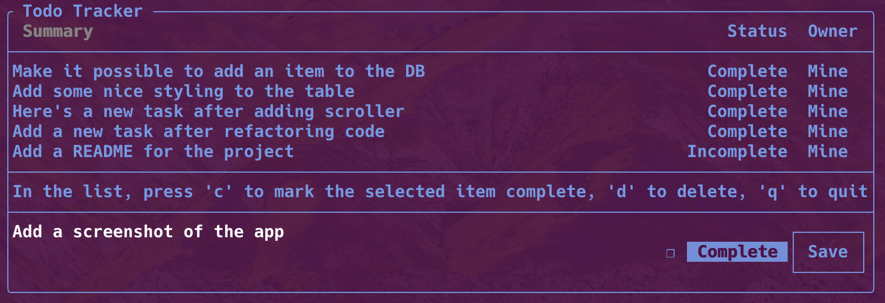

# FTXUI Task Tracker App

This task list application has a terminal UI built with [FTXUI](https://github.com/ArthurSonzogni/FTXUI), and persists 
data to the local file system using [Atlas Device SDK for C++](https://www.mongodb.com/docs/realm/sdk/cpp/).



A version of this app that uses [Atlas Device Sync](https://www.mongodb.com/docs/atlas/app-services/sync/) to sync data 
across devices is coming soon!

## Build the app

### Prerequisites

This app requires [CMake](https://cmake.org/). 

### Build with CMake

This repository's `.gitignore` assumes you're building from a `build` directory within the repository.

```shell
mkdir build && cd build && cmake ../
```

After configuring the project, build the executable.

```shell
cmake --build .
```

## Run the app

Assuming CMake built successfully, run the executable.

```shell
./local_todo
```

When you run the app, this creates a `db` directory in your `build` directory that contains an `item_objects.realm` file.
You can inspect and edit the contents of this file using [Realm Studio](https://www.mongodb.com/docs/realm/studio/).

For example, you could change the `owner_id` string to something other than "me" to see items in the app show up as 
"Them." In the Device Sync version of this app, there is a toggle to view only your own items, or view everyone's 
items. That app uses the logged-in user to determine the `owner_id` when creating and viewing the tasks.